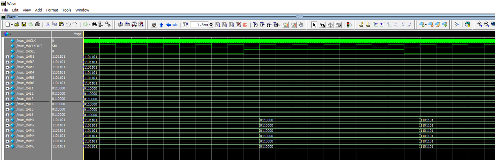

# **Velilog Stopwatch**
This is a term project for the **'Introductory Laboratory for Electrical and Electronic Engineering'** course at the Seoul National University of Science and Technology(**SEOULTECH**).

## **Work Condition**
- Computer Architecture : Digcom 3.2
- Software : QUARTUS II, ModelSim

## **System Block**
  
We programed Switch Interface, Counter, MUX, LAP ...

**CLK** : Generate 100 pulse per a second.  
**SW Interface** : 
- **Run/Stop** : When **mode** = LOW & **SW0** input, convert HIGH/LOW
- **Reset** : When **mode** = LOW & **SW1** = Pos Edge, HIGH
- **Sel** : When **mode** = LOW & **Run/Stop** = HIGH, convert HIGH/LOW if **SW2** is pushed
- **mode** : When **Run/Stop** = low, convert HIGH/LOW if **SW3** is pushed

**10 Counter** :
- Increase 0000 to 1001 by 1, when input pulse is negative edge & **Run/Stop** = HIGH
- When pulse is inputed at 1001, change to 0000
- Be changed to 0000, when **Reset** = HIGH

**6 Counter** :
- Increase 0000 to 0101 by 1, when input pulse is negative edge & **Run/Stop** = HIGH
- When pulse is inputed at 0101, change to 0000
- Be changed to 0000, when **Reset** = HIGH

**7SEG** : Convert 4 bit input to 7 bit Segment vector  
**LAP** : 
- Record **7SEG** and output when **Sel** is positive and output this value.
- When the **Reset** signal goes HIGH, it resets to 0 

**MUX1** :
- If **Sel** = LOW, output **Counter** 7SEG values
- If **Sel** = HIGH, output **LAP** values

**MUX2** :
- If **mode** = LOW, output **MUX1** values
- If **mode** = HIGH, output **D_Counter** 7SEG values

**Led_Driver** :
- If 0 <= Milli_L < 5 , output 00000000 to **LED_OUT**
- If 5 <= Milli_L < 10 , output 11111111 to **LED_OUT**
- Output **mode** value to **LED_MODE**

**D_Counter** : Timer Mode
- Activate when **mode** = 1
- Incerease value by 10 min, 1 min, 10 sec, 1 sec, when each switch is pushed

## **Simulation**  

  
**10 Counter** : Increase 0000 to 1001 and return to 0000

  
**6 Counter** : Increase 0000 to 0101 and return to 0000

  
**7 Seg** : Convert 4 bit number to 7 bit segment vector

  
**LAP** : Save values when **SEL** goes HIGH

  
**MUX** : Output R values when **SEL** = LOW, output L values when **SEL** = HIGH

## **Test**
https://github.com/Hyunkil76/Velilog_Stopwatch/assets/83130841/494e69a9-6f0d-4a80-ba12-27a1c6583c77

